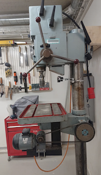

# July 2023

<!--
tbd. picture of the final stuff, rolling
-->

## Aim

- To understand track geometry pros/cons
- To study working with aluminum
- To try out Onshape as a CAD platform

## Requirements

- Licenses:
   - [Onshape](https://www.onshape.com/en/pricing) CAD; free account will do

- Access to:
  -  a [laser cutter](https://en.wikipedia.org/wiki/Laser_cutting)
  -  sanding machine
  -  table drill

- Materials:
  - Plywood (3mm): roughly 770 x 350 mm

     >Note: The dimensions don't need to be exactly that. You can rearrange the parts at cutting.

  - 2+4 wheels

     >The size of the wheels can vary - just adjust the CAD model accordingly.

  - Two blocks of wood
  - 1m M6 threaded rod (used in 6 pieces; each 10..15cm)

     >Use rod pieces you have "hanging around". :)

  - handful (10..12) M6 nuts (preferably flanged) and/or wing nuts
  - ca. 1m pieces of two aluminum pipes

     >Design uses 40mm and 25mm pipes, but you can use what is available. "Just" adjust the CAD model. 😜

   - wood glue

<!-- tbd.
- [ ] Picture of: plywood
     threaded rod
-->

### Budget

The author paid 9 eur for the plywood, getting the other parts free of charge from a local Hacklab.

|||
|---|---|
|Plywood|ca. 9 eur|
|wheels x 2+4|<10 eur|
|Aluminum pipes|< 5 eur|
|Steel threaded rod 1m, M6|< 2 eur|
|nuts M6|5..10 eur|
|total|< 25 eur|

Making the stand takes perhaps 2h, and the same for the bogey. Depends hugely on your skills, but let's say "a day" should always do.

## You will get

<!-- tbd. picture of the ready product -->

## Steps

Watch the attached video where I explain the process and why we're doing this.

### Common

1. Study the CAD model

   Adjust the dimensions to match your gear.

   >⚠️ Correct the circumference in the `Stand P-S` > `Extrude 1` step so that the *outer* diameter of the pipes is as per the sketch (e.g. 40 and 25 mm).

### Stand

1. Print the stand drawing to help in manufacturing it.

   Note that many dimensions (e.g. of the threaded rods) are meant to be floating. You can use the nuts to adjust to different relative dimensions between the two rails.

2. Make a stand.

### Bogey

1. Export the `Drawings` > `Sheet 1` in Onshape, into a DXF file.

2. At the laser cutter's program (e.g. [LightBurn](https://lightburnsoftware.com)):

   - Remove excessive lines
   - (optionally) move the pieces to match your available piece of plywood
   - create layers:
      - for the cutting (the author used speed `35`, power `65`)
      - for the sanding lines (the author used speed `100`, power `35`)

      >Note: The values may be laser cutter specific; I don't know. Let us know what machine you used and what values worked for you!

	- Set piece outlines to "cut" layer
	- Set edge lines of the teeth to the other layer

3. Try printing one part first.

   ⚠️ Check its dimensions to those in the CAD model. If there is shrinkage/expansion in your workflow, your pieces might not fit and at least the bogey won't fit the rails very well.

## What you learned

- working with Aluminum as a material
   - attaching screws to a round pipe

- working with plywood
   - designing for laser cutting
   - ..including non-right-angle binds
   - creating pieces to precise measure

- general design
   - understanding (and controlling) the size

- working with Onshape CAD
   - you may have needed to adjust the design, to fit your available parts

### Learnings for the upstream project

#### Rolling feel on aluminum rails

- [ ] How are the wheel sizes - what sizes would be suitable, going further?
- [ ] Is Aluminum an okay material for rails

#### Suitable sizes of rails, and their relative distances

We could go with pretty much any diameters at this stage - it starts to matter more once longer arcs are being built (stiffness vs. weight).

Also in the relative positioning, we could have:

|||
|---|---|
|support above main rail|looks good?|
|support on same level as main rail|boooring... 😴|
|support above main rail|allows less area for grip?1|

><small>`1` The grip issue is something studied in a future demo. You can ignore it for now.</small>

## Feedback

Feedback on this work can be sent to [`demo@outstanding.earth`](mailto:demo@outstanding.earth), or shared in the [Discussions](...) area.

<!-- tbd. Discord, and link to there.  -->

## References

- Onshape > [July 2023 model](https://cad.onshape.com/documents/f4329ece7fe15deaef06a130/w/91f2aeeb91807f537f9be8e4/e/075d6c6fe0f4db1ad2330aff)

- Youtube ... > [July 2023 episode]() *<-- tbd. to be filmed*
