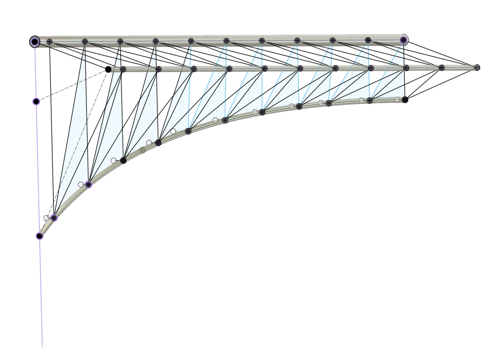

# June '23

## Aim

*Image 1. Semi-arc (straight) model*

To design and build the semi-arch shown in Image 1.

The model is meant for studying the manufacturability using carbon fibre tubes, fitted with 3D-printed parts to aluminum main rails and arc.

## Tests

**Test setup**

The semi-arc pictured in Image 1 assembled. 

- Left side tied to a stationary pole = not moving
- Test force applied to the rightmost tip in the picture (C1)

### Test 1

- Mark the horizontal and vertical position of the tips (A1, C1) without applying force
- Do the same with 5kg weights hanging from C1
- Measure the vertical and horizontal displacements

**Expectation**

*Not sure. Gut feel is that <5cm vertical displacement would be "fine". Really testing the waters, here.*

**Results**

| point                      | displacement (dx,dy) in mm |
|----------------------------|----------------------------|
| C1 |                            |
| A1 |                            |

<pre>tbd.</pre>

### Test 2

Repeat Test 1, with the 5kg pulling *upwards* in C1.

**Results**

<pre>tbd.</pre>

## Report

<pre>tbd.</pre>

<!-- Video would have e.g.
- components and costs 
- learnings

Based on the video, one should be able to replicate the work.
-->

## Learnings

>In any project, it's important to realize what was learned.

### Supports within pipes

**Don't Do Them!**

When pipes were angled enough, the slicer (Cura) created supports within them. I sliced the S3 prints and 2 Connected prints with slightly different settings, it seems. One is is really difficult to remove ("normal supports") whereas the other ("tree supports?") can be jiggled and pulled out - with the help of a screw at times..

Anyways, I doubt they were actually even needed. Could just remove supports manually when they occur within the pipes, and proof before epoxying that the rods fit in. Likely, only unevenness would be caused and since it's on the inside, it doesn't matter.

### Sanding - lesson in reduction of steps & tools!

:)

I had thought to:

- glue sandpaper to a stick of wood, and run a drilling machine to roughen the insides of the 3D-printed pipes

Quickly noticed:

- [x] machine is not necessary - hand turning gives better control
- [x] gluing is not necessary (it came off) - just wrap sand paper around the stick and roll!
- [ ] **sanding** might not be necessary?

   Need to test this, by doing two joints, one with and one without sanding.
   
   The grooves between the 3D-printed layers may turn out to be enough to keep the gluing strong.
