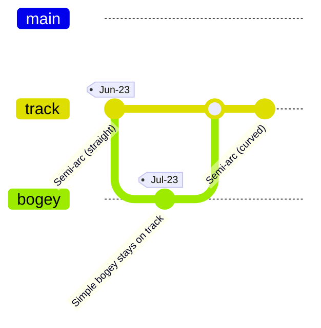

# Roadmap

<!-- (mis)using GitGraph to show dependencies

tbd. Would like to have links from "commit id" to Jun'23 page
-->

- [Jun'23](./Jun-23/index.md)

In Jun/Jul 2023, a simple track design is checked for viability. The size of the track (and the vehicle) is such that it can be used for park demos. The track is easily installable / dismantlable into 2,5..3m sections.

**Ultimate aim**

- [ ] Demonstrate outside

## References

- [Mermaid](https://mermaid.js.org)

